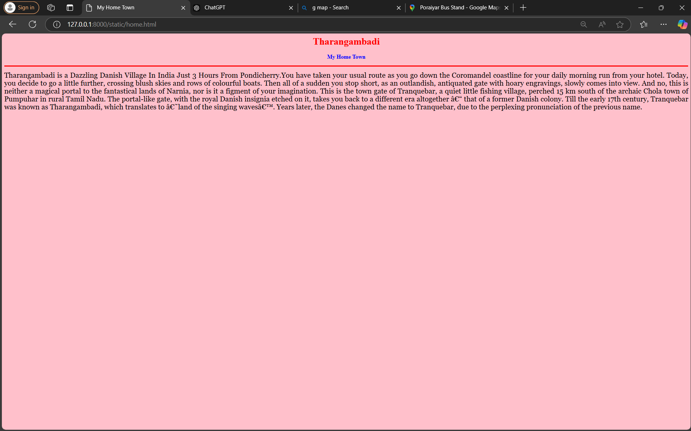
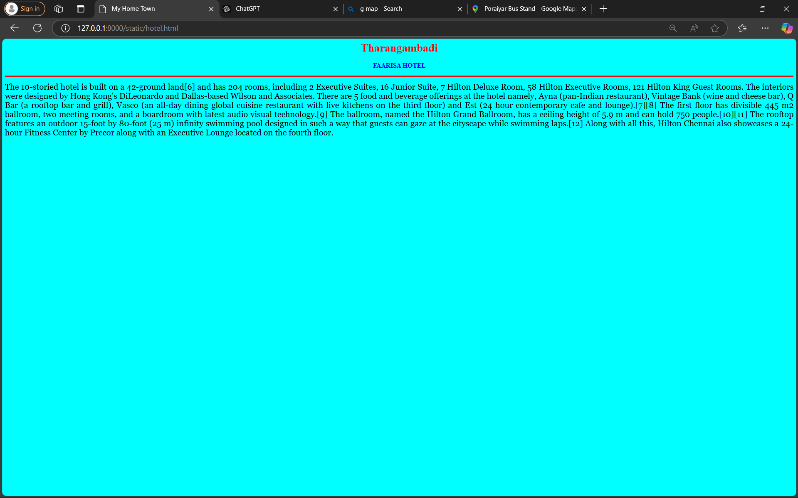
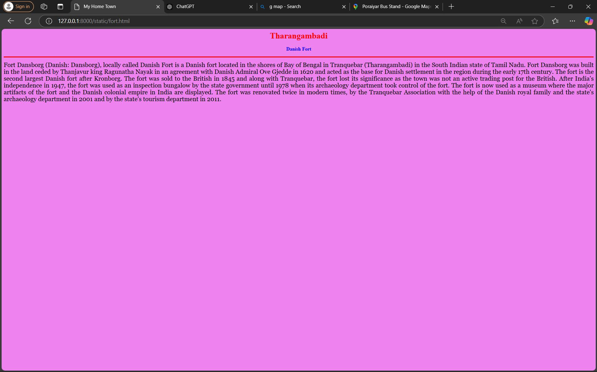
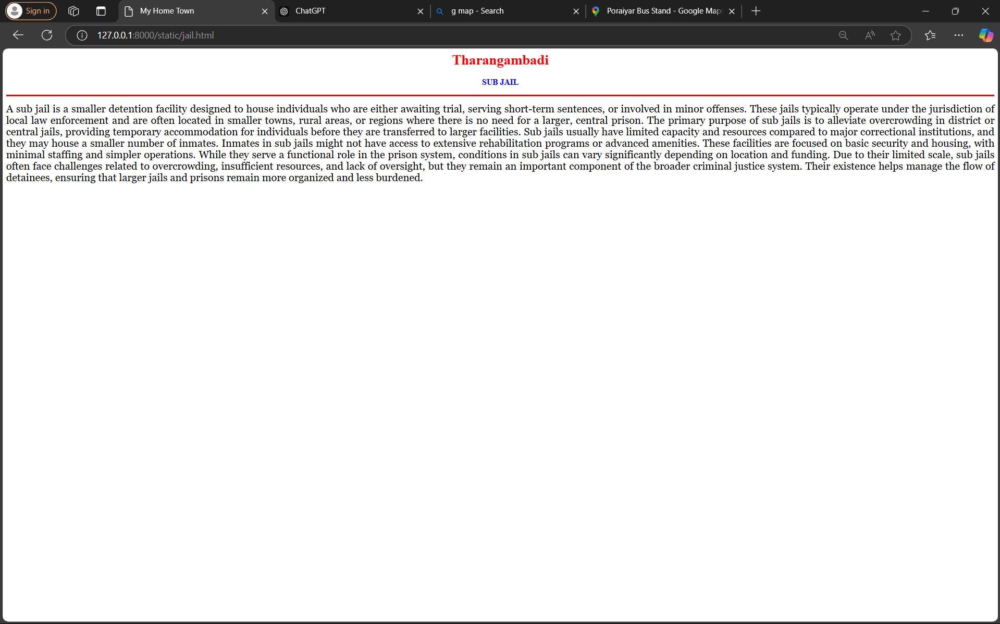
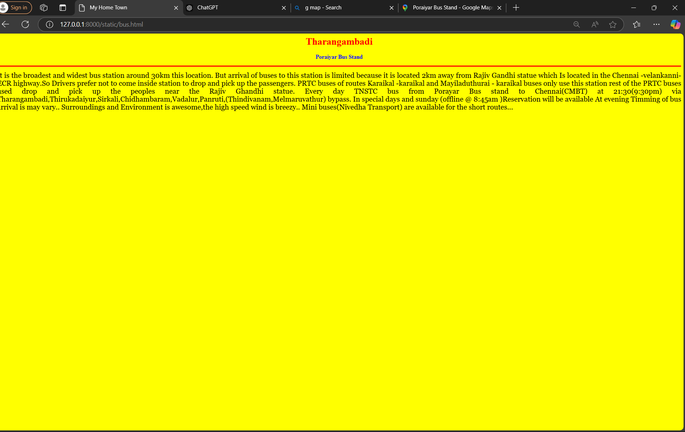

# Ex04 Places Around Me
## Date: 20/11/2024

## AIM
To develop a website to display details about the places around my house.

## DESIGN STEPS

### STEP 1
Create a Django admin interface.

### STEP 2
Download your city map from Google.

### STEP 3
Using ```<map>``` tag name the map.

### STEP 4
Create clickable regions in the image using ```<area>``` tag.

### STEP 5
Write HTML programs for all the regions identified.

### STEP 6
Execute the programs and publish them.

## CODE
```
map.html

<html>
<head>
<title>My City</title>
</head>
<body>
<h1 align="center">
<font color="red"><b>Tharangambadi</b></font>
</h1>
<h3 align="center">
<font color="blue"><b>Jahan.J (24004359)</b></font>
</h3>
<center>


<map name="image-map">
<area target="" alt="tharangambadi" title="tharangambadi" href="home.html" coords="1172,457,1354,524" shape="rect">
<area target="" alt="danish" title="danish" href="fort.html" coords="1134,635,1364,698" shape="rect">
<area target="" alt="jail" title="jail" href="jail.html" coords="178,513,425,628" shape="rect">
<area target="" alt="hotel" title="hotel" href="hotel.html" coords="1002,539,83" shape="circle">
<area target="" alt="busstand" title="busstand" href="bus.html" coords="367,910,397,866,582,859,600,913,567,963,380,966" shape="poly">
</map>
</center>
</body>
</html>

home.html

<html>
<head>
<title>My Home Town</title>
</head>
<body bgcolor="pink">
<h1 align="center">
<font color="red"><b>Tharangambadi</b></font>
</h1>
<h3 align="center">
<font color="blue"><b>My Home Town</b></font>
</h3>
<hr size="3" color="red">
<p align="justify">
<font face="Georgia" size="5">
    Tharangambadi is a Dazzling Danish Village In India Just 3 Hours From Pondicherry.You have taken your usual route as you go down the Coromandel coastline for your daily morning run from your hotel. Today, you decide to go a little further, crossing blush skies and rows of colourful boats. Then all of a sudden you stop short, as an outlandish, antiquated gate with hoary engravings, slowly comes into view. And no, this is neither a magical portal to the fantastical lands of Narnia, nor is it a figment of your imagination.

    This is the town gate of Tranquebar, a quiet little fishing village, perched 15 km south of the archaic Chola town of Pumpuhar in rural Tamil Nadu. The portal-like gate, with the royal Danish insignia etched on it, takes you back to a different era altogether – that of a former Danish colony.
    
    Till the early 17th century, Tranquebar was known as Tharangambadi, which translates to ‘land of the singing waves’. Years later, the Danes changed the name to Tranquebar, due to the perplexing pronunciation of the previous name.
</font>
</p>
</body>
</html>

fort.html

<html>
<head>
<title>My Home Town</title>
</head>
<body bgcolor="violet">
<h1 align="center">
<font color="red"><b>Tharangambadi</b></font>
</h1>
<h3 align="center">
<font color="blue"><b>Danish Fort</b></font>
</h3>
<hr size="3" color="red">
<p align="justify">
<font face="Georgia" size="5">
    Fort Dansborg (Danish: Dansborg), locally called Danish Fort  is a Danish fort located in the shores of Bay of Bengal in Tranquebar (Tharangambadi) in the South Indian state of Tamil Nadu. Fort Dansborg was built in the land ceded by Thanjavur king Ragunatha Nayak in an agreement with Danish Admiral Ove Gjedde in 1620 and acted as the base for Danish settlement in the region during the early 17th century. The fort is the second largest Danish fort after Kronborg. The fort was sold to the British in 1845 and along with Tranquebar, the fort lost its significance as the town was not an active trading post for the British. After India's independence in 1947, the fort was used as an inspection bungalow by the state government until 1978 when its archaeology department took control of the fort. The fort is now used as a museum where the major artifacts of the fort and the Danish colonial empire in India are displayed.

    The fort was renovated twice in modern times, by the Tranquebar Association with the help of the Danish royal family and the state's archaeology department in 2001 and by the state's tourism department in 2011.
</font>
</p>
</body>
</html>

bus.html

<html>
<head>
<title>My Home Town</title>
</head>
<body bgcolor="Yellow">
<h1 align="center">
<font color="red"><b>Tharangambadi</b></font>
</h1>
<h3 align="center">
<font color="blue"><b>Poraiyar Bus Stand</b></font>
</h3>
<hr size="3" color="red">
<p align="justify">
<font face="Georgia" size="5">
     It is the broadest and widest bus station around 30km this location.
     But arrival of buses to this station is limited because it is located 2km away from Rajiv Gandhi statue which Is located in the Chennai -velankanni-ECR highway.So Drivers prefer not to come inside station to drop and pick up the passengers.
     PRTC buses of routes Karaikal -karaikal and Mayiladuthurai - karaikal buses only use this station rest of the PRTC buses used drop and pick up the peoples near the Rajiv Ghandhi statue.
     Every day TNSTC bus from Porayar Bus stand  to Chennai(CMBT) at 21:30(9:30pm)
    via Tharangambadi,Thirukadaiyur,Sirkali,Chidhambaram,Vadalur,Panruti,(Thindivanam,Melmaruvathur) bypass.
    In special days and sunday (offline @ 8:45am )Reservation will be available
     At evening Timming of bus arrival is may vary..
    Surroundings and Environment is awesome,the high speed wind is breezy..
    Mini buses(Nivedha Transport) are available for the short routes...
</font>
</p>
</body>
</html>

hotel.html

<html>
<head>
<title>My Home Town</title>
</head>
<body bgcolor="cyan">
<h1 align="center">
<font color="red"><b>Tharangambadi</b></font>
</h1>
<h3 align="center">
<font color="blue"><b>FAARISA HOTEL</b></font>
</h3>
<hr size="3" color="red">
<p align="justify">
<font face="Georgia" size="5">
    The 10-storied hotel is built on a 42-ground land[6] and has 204 rooms, including 2 Executive Suites, 16 Junior Suite, 7 Hilton Deluxe Room, 58 Hilton Executive Rooms, 121 Hilton King Guest Rooms. The interiors were designed by Hong Kong's DiLeonardo and Dallas-based Wilson and Associates. There are 5 food and beverage offerings at the hotel namely, Ayna (pan-Indian restaurant), Vintage Bank (wine and cheese bar), Q Bar (a rooftop bar and grill), Vasco (an all-day dining global cuisine restaurant with live kitchens on the third floor) and Est (24 hour contemporary cafe and lounge).[7][8]

    The first floor has divisible 445 m2 ballroom, two meeting rooms, and a boardroom with latest audio visual technology.[9] The ballroom, named the Hilton Grand Ballroom, has a ceiling height of 5.9 m and can hold 750 people.[10][11]
    
    The rooftop features an outdoor 15-foot by 80-foot (25 m) infinity swimming pool designed in such a way that guests can gaze at the cityscape while swimming laps.[12]
    
    Along with all this, Hilton Chennai also showcases a 24-hour Fitness Center by Precor along with an Executive Lounge located on the fourth floor.
</font>
</p>
</body>
</html>

jail.html

<html>
<head>
<title>My Home Town</title>
</head>
<body bgcolor="white">
<h1 align="center">
<font color="red"><b>Tharangambadi</b></font>
</h1>
<h3 align="center">
<font color="blue"><b>SUB JAIL</b></font>
</h3>
<hr size="3" color="red">
<p align="justify">
<font face="Georgia" size="5">
    A sub jail is a smaller detention facility designed to house individuals who are either awaiting trial, serving short-term sentences, or involved in minor offenses. These jails typically operate under the jurisdiction of local law enforcement and are often located in smaller towns, rural areas, or regions where there is no need for a larger, central prison. The primary purpose of sub jails is to alleviate overcrowding in district or central jails, providing temporary accommodation for individuals before they are transferred to larger facilities. Sub jails usually have limited capacity and resources compared to major correctional institutions, and they may house a smaller number of inmates.

    Inmates in sub jails might not have access to extensive rehabilitation programs or advanced amenities. These facilities are focused on basic security and housing, with minimal staffing and simpler operations. While they serve a functional role in the prison system, conditions in sub jails can vary significantly depending on location and funding. Due to their limited scale, sub jails often face challenges related to overcrowding, insufficient resources, and lack of oversight, but they remain an important component of the broader criminal justice system. Their existence helps manage the flow of detainees, ensuring that larger jails and prisons remain more organized and less burdened.
</font>
</p>
</body>
</html>

```

## OUTPUT







## RESULT
The program for implementing image maps using HTML is executed successfully.
